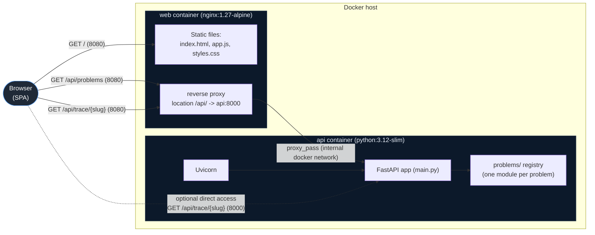
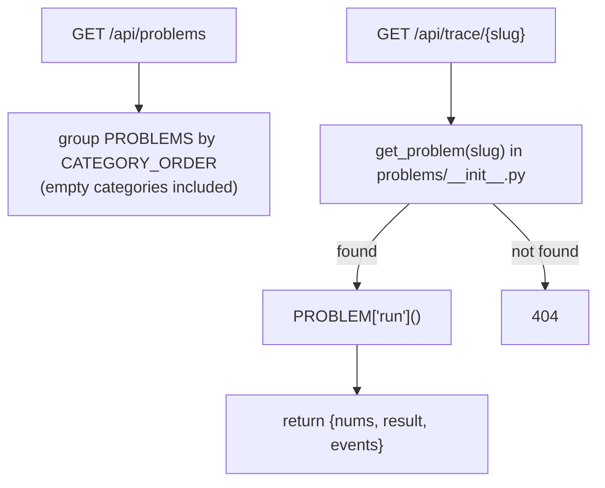
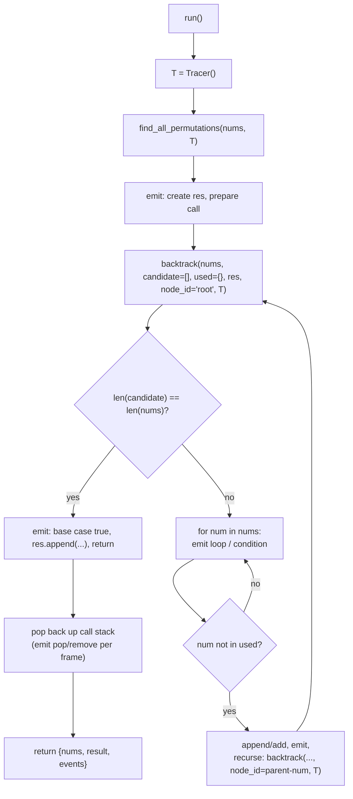
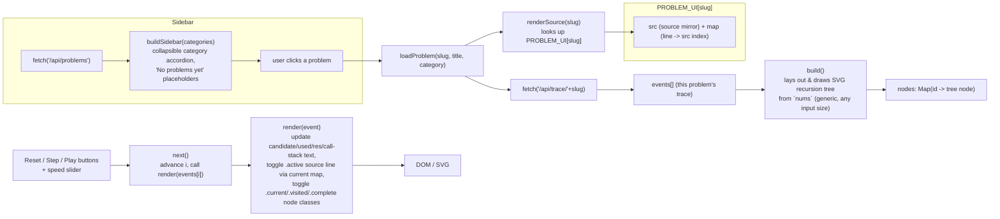
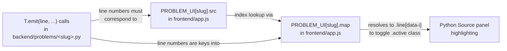

# Architecture

This document describes how this **algorithm study tool** is put together: the technologies involved, how the two services talk to each other, and how a backend-computed execution trace for whichever problem is selected becomes an interactive, replayable animation in the browser.

## What it is

An interactive tool for studying algorithms, organized as a categorized, collapsible sidebar
of problems (Two Pointers, Sliding Window, Backtracking, Heaps, ...) — built so new problems
can be dropped in over time without changing the architecture. Today exactly one problem is
wired up end-to-end: **Find All Permutations**, under the Backtracking category.

For whichever problem is selected, the algorithm actually **executes in Python** on the
backend; the **JavaScript frontend only replays** the resulting trace (recursion tree,
`candidate`/`used`/`res` state, call stack, and synchronized source-code highlighting).
There is no build step or package manager on either side.

## Running the project

The whole stack (frontend + backend) runs via Docker Compose:

```bash
docker compose up --build
```

Then open **http://localhost:8080** for the app. The API alone is reachable directly on
**http://localhost:8000** (e.g. `http://localhost:8000/api/problems`,
`http://localhost:8000/api/trace/find-all-permutations`, `http://localhost:8000/health`).

Both containers bake the source into the image at build time (no volume mounts), so **any
code change — including adding a new problem — requires re-running
`docker compose up --build`** to take effect.

To stop the stack:

```bash
docker compose down
```

This stops and removes both containers (and the default network Compose created for them),
but leaves the built images on disk — `docker compose up` next time starts fast without
rebuilding. Add `--rmi local` if you also want to delete the images built for this project
(`permutation-visualizer-api`, `permutation-visualizer-web`).

For quick backend-only iteration without Docker:

```bash
cd backend
pip install -r requirements.txt
uvicorn main:app --reload --port 8000
```

For frontend iteration, just edit the static files in `frontend/` and serve them with any
static server (or reuse nginx via `docker compose up --build web`) — there is no
bundler/transpile step.

There are no tests, linters, or formatters configured in this repo.

## Technology stack

| Layer                | Technology                                      | Notes |
|-----------------------|--------------------------------------------------|-------|
| Backend runtime       | Python 3.12                                      | `python:3.12-slim` base image |
| Backend framework     | FastAPI 0.115 + Uvicorn 0.34 (`[standard]`)      | Routes: `/api/problems`, `/api/trace/{slug}`, `/api/trace` (legacy alias), `/health` |
| Problem registry      | Plain Python dicts/list                          | `backend/problems/` — no plugin framework, just a list a route looks up |
| CORS                  | `fastapi.middleware.cors.CORSMiddleware`         | `allow_origins=["*"]` |
| Frontend              | Vanilla JavaScript (ES2021+), HTML5, CSS3        | No framework, no bundler, no npm |
| Frontend rendering    | Raw inline **SVG** via `document.createElementNS` | Recursion tree is hand-drawn, no charting library |
| Web server            | nginx `1.27-alpine`                              | Serves static files + reverse-proxies `/api/` |
| Containerization      | Docker + Docker Compose                          | Two services: `api`, `web` |
| Transport             | Plain HTTP (`fetch`)                             | **No WebSocket**, no SSE — one-shot request per problem, full trace returned at once |
| Data interchange      | JSON                                             | `{categories:[...]}` for the sidebar, `{nums, result, events}` per trace |
| Client-side state     | `localStorage`                                   | Persists sidebar collapsed/expanded state only — not algorithm data |

There is no database, no auth layer, no build tooling (Webpack/Vite/etc.), and no external
JS/CSS dependencies — everything shipped to the browser is written by hand.

## Container / deployment topology



- `docker compose up --build` builds and starts both containers.
- `web` is published on **:8080** (the SPA entry point) and proxies any `/api/*` path to the
  `api` service **by its Compose service name** (`api:8000`), so the browser only ever talks
  to one origin (`localhost:8080`) — no CORS issues in normal use, even though CORS is wide
  open for the case where `api:8000` is hit directly.
- `api` is also published directly on **:8000** for quick manual/backend-only iteration.
- Neither container mounts the source as a volume — frontend/backend code is **baked into
  the image at build time**, so any code change (including adding a new problem) requires
  `docker compose up --build`.

## Request flow (loading the page, picking a problem, driving playback)

```mermaid
sequenceDiagram
    participant B as Browser (app.js)
    participant N as nginx (web:80)
    participant A as FastAPI (api:8000)

    B->>N: GET /
    N-->>B: index.html, app.js, styles.css

    B->>N: GET /api/problems
    N->>A: proxy_pass /api/problems
    A-->>N: {categories: [{name, problems:[{slug,title}]}]}
    N-->>B: JSON response
    Note over B: buildSidebar() renders categories\n(collapsible, "No problems yet" if empty);<br/>first available problem auto-selected

    B->>N: GET /api/trace/{slug}
    N->>A: proxy_pass /api/trace/{slug}
    Note over A: look up PROBLEM by slug in the registry<br/>T = Tracer(); PROBLEM["run"]()<br/>instrumented with T.emit(...) at each step
    A-->>N: {nums, result, events}
    N-->>B: JSON response

    Note over B: renderSource(slug) shows that problem's\nPROBLEM_UI source mirror;<br/>build() draws the recursion tree from `nums`;<br/>reset() initializes the state panel

    loop user clicks Step / Play
        Note over B: next() reads events[i++]<br/>render(event) updates DOM only —<br/>no further network calls
    end

    opt user picks a different sidebar problem
        Note over B: loadProblem(slug) repeats the\nGET /api/trace/{slug} step above
    end
```

Key point: for whichever problem is active, its **entire trace is computed once, up front**.
Playback (`next` / `play` / `stop` / `reset` in `app.js`) is a pure client-side walk over the
`events` array already in memory, driven by `setTimeout` at the speed selected on the slider.
There is no live connection, streaming, or WebSocket — the whole animation is just DOM/SVG
class toggling. Switching problems in the sidebar is the only thing that triggers a new trace
fetch.

## Backend: a registry of problems, each the source of truth for its own algorithm and trace

`backend/main.py` only does routing; it doesn't know how any particular algorithm works:



Each problem lives in its own module under `backend/problems/` and exports a `PROBLEM` dict:

```python
PROBLEM = {
    "slug": "find-all-permutations",  # used in the URL and as the frontend lookup key
    "title": "Find All Permutations", # shown in the sidebar and page header
    "category": "Backtracking",       # must be one of CATEGORY_ORDER
    "run": run,                       # () -> {"nums", "result", "events"}
}
```

`backend/problems/__init__.py` holds `CATEGORY_ORDER` (the fixed sidebar section order —
currently Two Pointers, Sliding Window, Backtracking, Heaps) and the `PROBLEMS` list that
`main.py` and `/api/problems` read from. A category with zero registered problems still
appears in the sidebar output, so the frontend can render it as a placeholder.

### How a problem instruments its trace (the `find-all-permutations` example)

The one problem implemented today, `backend/problems/permutations.py`, runs the *real*
backtracking algorithm — it is not a simulation of one. A `Tracer` is created fresh per
request, and every meaningful step of the algorithm calls `T.emit(line, action, candidate,
used, res, node_id, message)` to append a structured event:



Any future problem follows the same shape — its own `Tracer`-style instrumentation, its own
`run()` — but the specific fields inside each event (here `candidate`/`used`/`res`) are free
to differ per algorithm; the frontend only needs a matching `PROBLEM_UI` entry (see below) to
know how to show it.

Each event carries a full, deep-copied snapshot, so the frontend never has to reconstruct
state incrementally — every event is self-sufficient for rendering one frame. For this
problem, `node_id` encodes the recursion-tree path as `root-1-3` style strings (parent id +
chosen number), which the frontend uses directly as SVG element `data-id` attributes.

## Frontend: a generic replay engine plus a per-problem sidebar and source mirror

`frontend/app.js` is a single script. Most of it is **problem-agnostic** (sidebar loading,
playback controls, the SVG recursion-tree renderer); one lookup table, `PROBLEM_UI`, is where
problem-specific frontend data lives.



- `PROBLEM_UI` is a **slug-keyed lookup**: `PROBLEM_UI["find-all-permutations"] = {src, map}`.
  A problem with no entry still runs (trace, tree, state panel all work), it just shows a
  placeholder instead of a source-code panel — so a backend-only stub doesn't break the UI.
- `src` (array of strings) is a **hand-maintained, simplified mirror** of that problem's
  Python source, shown in the "Python Source" panel.
- `map` translates the numeric `line` values emitted by that problem's backend module into
  indices into its own `src`.
- `build()` computes recursion-tree node positions purely from `nums.length`, so it works
  unchanged for any input size — it has no knowledge of which problem is loaded.
- `render(event)` is the only function that touches the DOM per frame: a straightforward
  "apply this snapshot" function, not incremental state tracking.
- Sidebar collapse state and which categories are expanded are persisted per-browser via
  `localStorage`; the selected problem itself is not persisted across reloads (reloading
  always starts from the first available problem).

## Key coupling to watch (per problem)

For **each** registered problem, three things must stay in sync, because none of this
mapping is derived automatically — it's manually maintained across two files:



Changing instrumented line numbers in a problem's backend module, or reordering lines in its
`src`, without updating its `map` accordingly will make source-line highlighting silently
point at the wrong line (or omit new events from the visualization entirely) — **for that
problem only**; other problems' mappings are independent.

## How to add a new problem

1. Create `backend/problems/<name>.py` implementing the real algorithm, instrumented with
   `T.emit(...)` calls the same way `permutations.py` does, and export a `PROBLEM` dict
   (`slug`, `title`, `category` — must match an entry in `CATEGORY_ORDER`, `run`).
2. Register it in `backend/problems/__init__.py`'s `PROBLEMS` list.
3. Add a matching entry to `PROBLEM_UI` in `frontend/app.js` (`src` + `map`) so the source
   panel and highlighting work for it.
4. `docker compose up --build` — it shows up under its category in the sidebar automatically,
   with no other frontend or routing changes required.

If the new problem's visualization needs more than a recursion tree (e.g. an array with
pointer markers for Two Pointers/Sliding Window, or a binary-heap array for Heaps), that's a
bigger step: `build()`/`render()` currently assume a tree-shaped state and would need a
per-problem-type rendering path — not something the current registry handles yet.

## What's deliberately *not* here

- **No database** — each problem's input is hardcoded in its module (e.g. `[1, 2, 3]` for
  permutations); nothing is persisted between requests.
- **No WebSocket/SSE/streaming** — confirmed by inspection, the only network calls are
  `GET /api/problems` and `GET /api/trace/{slug}`.
- **No build step** — no `package.json`, bundler, or transpiler on the frontend; no ORM or
  migration tooling on the backend.
- **No Manim** (or any other animation/rendering library) — the recursion tree is plain SVG
  built and mutated directly with DOM APIs.
- **No tests/linters** configured in this repo today.
